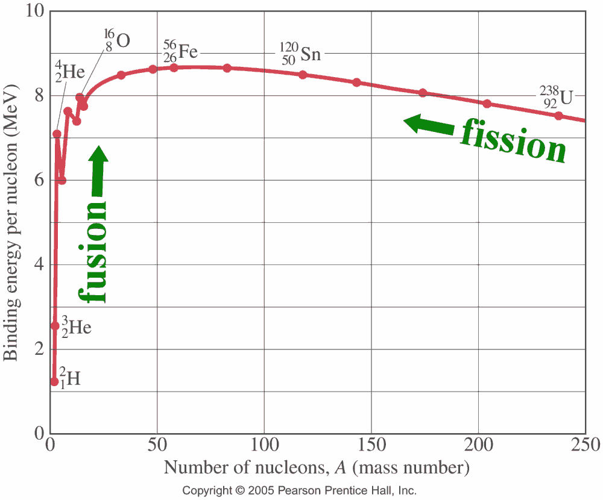
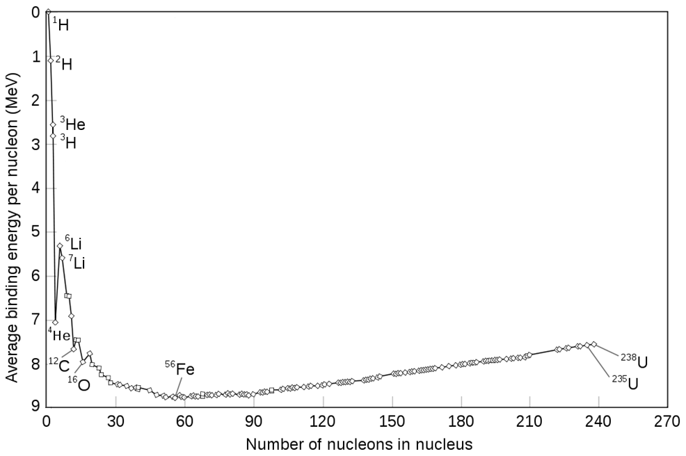

---
title: BINDING ENERGY
uuid: binding-energy
prerequisites:
  - shell-model 
learning_objecives:
  - Determine binding energy per nucleon for isotopes
  - Compare binding energy per nucleon for different isotopes
  - Analyze implications thereof
references:
  - lamarsh.bib
abet_outcomes: n/a
assessments:
  - binding-energy.yml
...
# Binding energy
## Learning objective
Determine binding energy per nucleon for isotopes  
Compare binding energy per nucleon for different isotopes  
Analyze implications thereof

## Forces of interaction
There are four fundamental forces in the universe that essentially govern matter. 

1. Gravity
2. *Strong nuclear*
3. Electromagnetic
4. Weak nuclear

Gravity is obvious. Electromagnetic basically is why like charges, like electrons, repel, or opposites attract. 

The weak force involves the exchange of bosons and are how the flavor of quarks change. 

In nuclear engineering, we are most interested in the strong nuclear force. This force literally holds the nucleus together and is very strong indeed. If the strength of the strong nuclear force is assigned a value of 1, comparatively, the strength of gravity is $10^{-38}$.

The fission process is dependent on splitting of the atom, and therefore need to know the binding energy for a particular isotope in order to split it. Given how strong the strong nuclear force is, it should be initutive that splitting a large atom should release a lot of energy. 

## Mass defect
The mass of a given isotope is not equal to the sum of the masses of its components, or nucleons. This is defined as the mass defect. Where is the missing mass?

The mass is not really missing but is an example of the equivalence of matter and energy. $E=mc^2$. The binding energy as a result of the strong nuclear force represents the missing mass. Therefore the binding energy is the amount of energy that holds the nucleons together in the nucleus for an isotope. 

The strong nuclear force is very important. Since protons have a positive charge, the particles have a tendency to repel based on the electromagnetism. We know that they clearly do not, since atoms make up the matter in the universe. The strong nuclear force and the binding energy is so strong that the nucleus stays in tact.

## Example
Mass defect is defined as:  
$\delta m = Z \cdot p+N \cdot n-M$

Where:  
* Z = number of protons
* N = number of neutrons
* p = mass of a proton
* n = mass of a neutron
* M = atomic mass of the isotope

Note that N = A - Z, where A is the mass number of the isotope.

Perform the calculation for mass defect in atomic mass units. Then, apply this helpful shortcut and multiplying the result by *931.5 MeV/amu* to obtain the value for the mass defect in terms of energy. 

With some arithmetic, the binding energy is 1759 MeV. It is useful, however, to present the result in terms of binding energy per nucleon. For 239 nucleons in this isotope of plutonium, we obtain 7.40 MeV per nucleon. 

Binding energy is used to compare atomic stability, reaction energy, and probability of fission or fusion. A common depiction is shown below.

Rotating the chart can be instructive. 

Here, it can be seen that Fe-56 has the highest binding energy per nucleon. Isotopes will tend to a more tightly bound state. For light nuclei, this means that the fusion process is more likely, as they combine to form heavier nuclei.

For heavy nuclei like U-235, the fission process will cause them to split and eject lighter nuclei to reach a more tightly bound state. 
