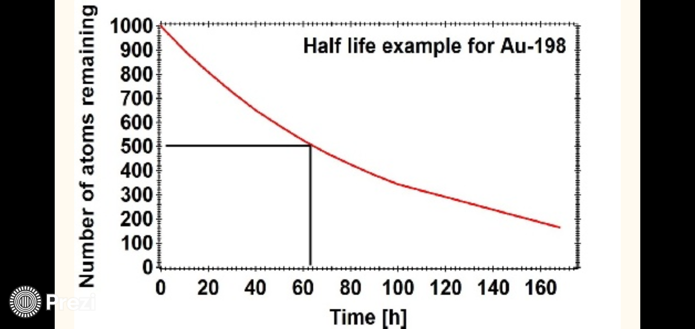
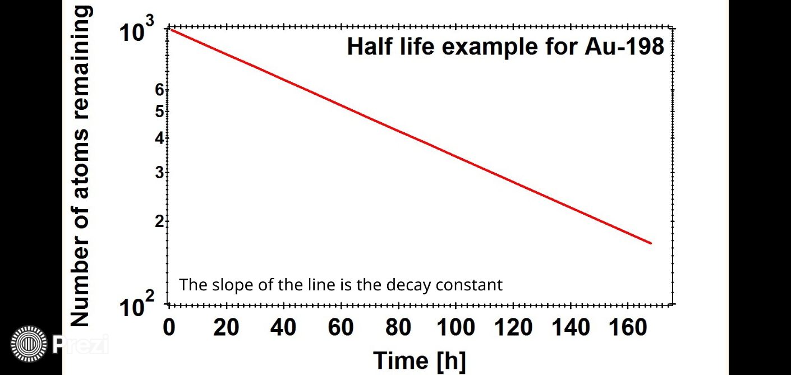

---
title: HALF LIFE
uuid: half-life
prerequisites:
  - bateman equation node
  - poisson distribution node
learning_objectives:
  - Apply the decay equation to identify an unknown radioisotope 
references:
  - lamarsh.bib
abet_outcomes: n/a
assessments: 
  - counts.csv
  - half-life.yml
...
# Half life
## Learning objective
Apply the decay equation to identify an unknown radioisotope  

### Characterizing radionuclides 
While the decay constant is a unique identifier for a radionuclide, it is more straightforward to use half-life instead. The decay constant is in units of $T^{-1}$, but we derive half life just in units of time, so it is easier to understand. 

The half-life can be obtained using the decay law by substituting n(t) = $0.5n_0$ and solving for t. 

A radionuclide is considered negligible after 10 half-lives have elapsed. 

The following example for Au-198 shows how the half-life can obtained.

If a semi-log plot is used, then the decay constant is just the slope of the line.

A typical introductory laboratory exercise would be to take an unknown radioactive sample, record the counts at certain intervals, like every 30 seconds, and then plot the result. A fairly straightforward regression routine can be used to obtain the decay constant and then the half-life. 
_
### Additional Reading
[OER Radioactive Decay Notes](https://courses.candelalearning.com/x84x9/chapter/radioactive-decay)
